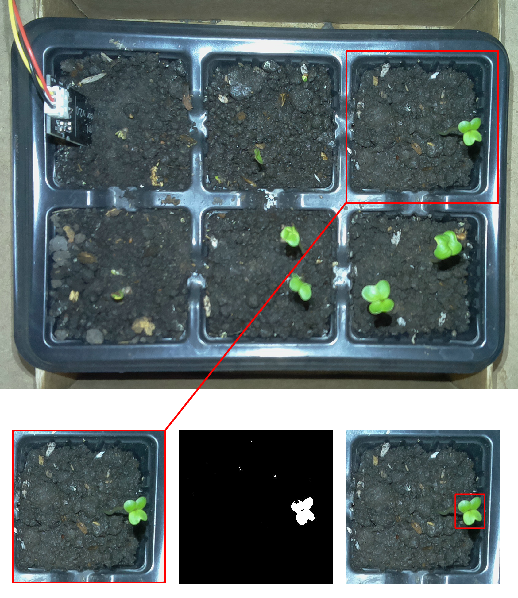

# Sistema Embarcado para Monitoramento de Germinação de Sementes em Bandeja



> O sistema reconhece, analisa e apresenta a quantidade de sementes germinadas e dados provenientes dos sensores para que os produtores tenham controle sobre o rendimento de produção de suas culturas e informações microclimáticas do ambiente.

## Resultados

Verifique os resultados obtidos [AQUI] (https://drive.google.com/drive/u/1/folders/1PISZtUB6TjI5krvNnnQtpTtU1Wg7sSSy)

### Ajustes e melhorias

Embora o protótipo tenha cumprido sua função durante os experimentos, alterações são necessárias afim de deixar o sistema mais completo. O projeto não esta mais em desenvolvimento, trabalhos futuros:

- [x] Protótipo
- [ ] Aplicação em campo
- [ ] Aplicar nova técnica de visão computacional para detecção da germinação das sementes
- [ ] Avaliar o consumo de energia

## 💻 Pré-requisitos

Antes de começar, verifique se você atendeu aos seguintes requisitos:
* Raspberry Pi3 Model B+ e sensores - leia `/meu_tcc>`.
* Você instalou as versões mais recente de: `Node e Python e todas as dependências requeridas`.

## 🚀 Executando

Para executar, siga estas etapas:

```
<npm start>
```

## ☕ Usando <nome_do_projeto>

Para utilizar, acesse no browser:

```
localhost:3000
```

## 🤝 Colaboradores

Orientador:

<table>
  <tr>
    <td align="center">
      <a href="https://www.linkedin.com/in/wesley-angelino-de-souza-00664033/">
        <sub>
          <b>Wesley Angelino de Souza</b>
        </sub>
      </a>
    </td>
  </tr>
</table>


## 😄 Dê continuidade nesse projeto...<br>

Quer fazer parte desse projeto? Entre em contato: [Wesley Angelino de Souza] (https://www.linkedin.com/in/wesley-angelino-de-souza-00664033/)
